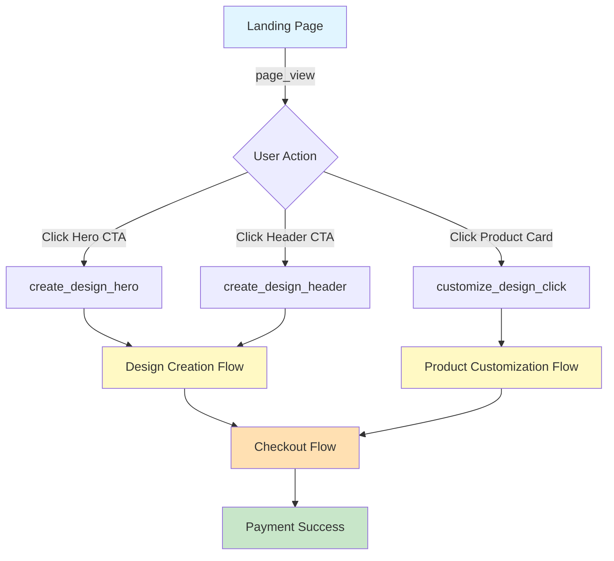
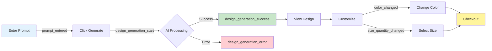
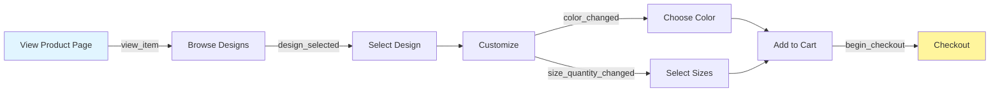
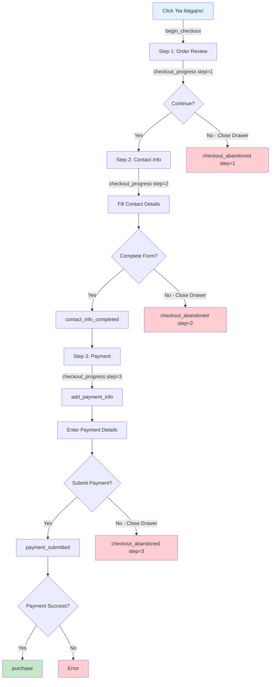
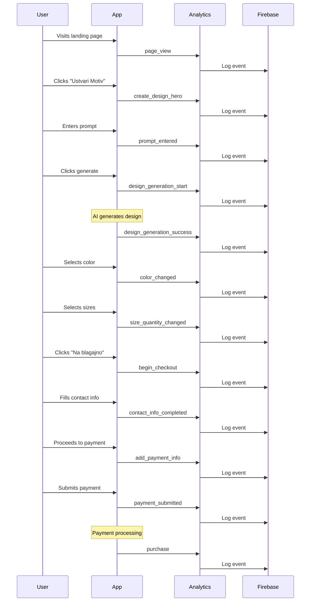
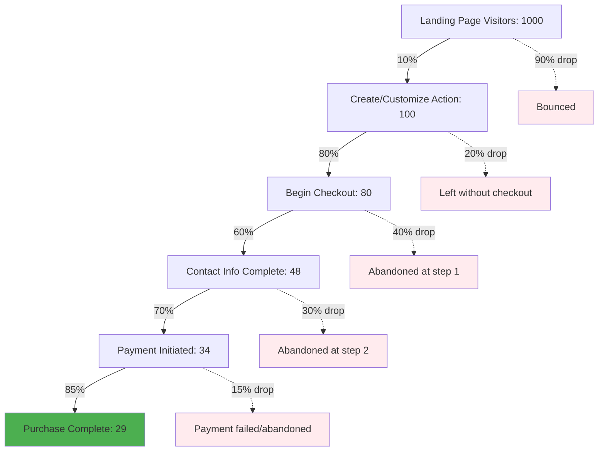
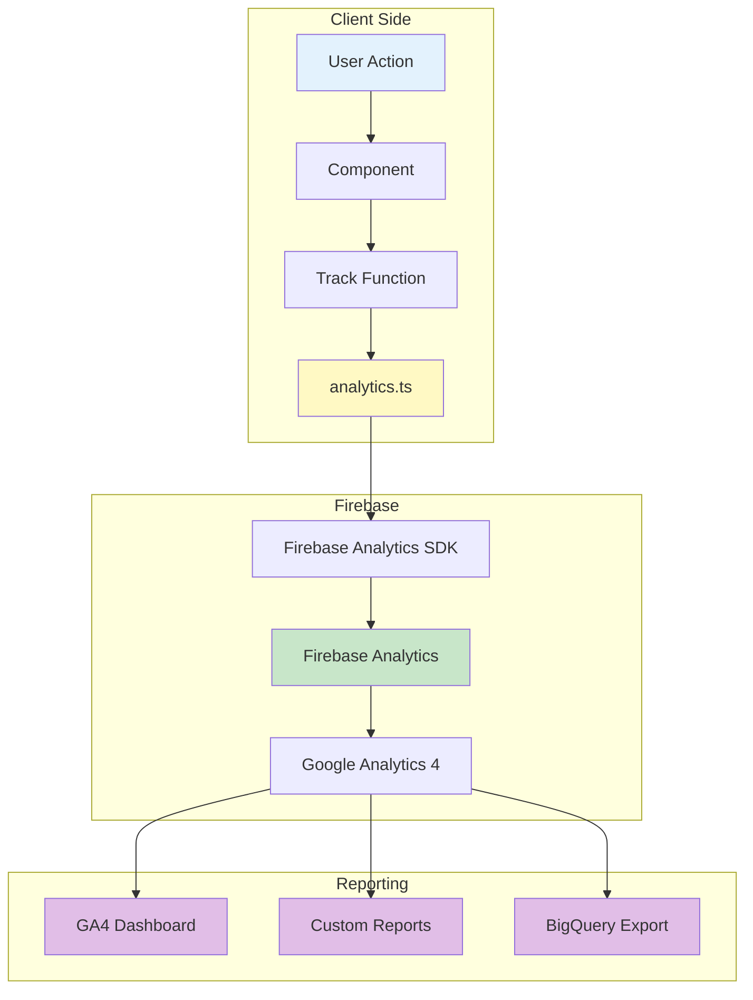
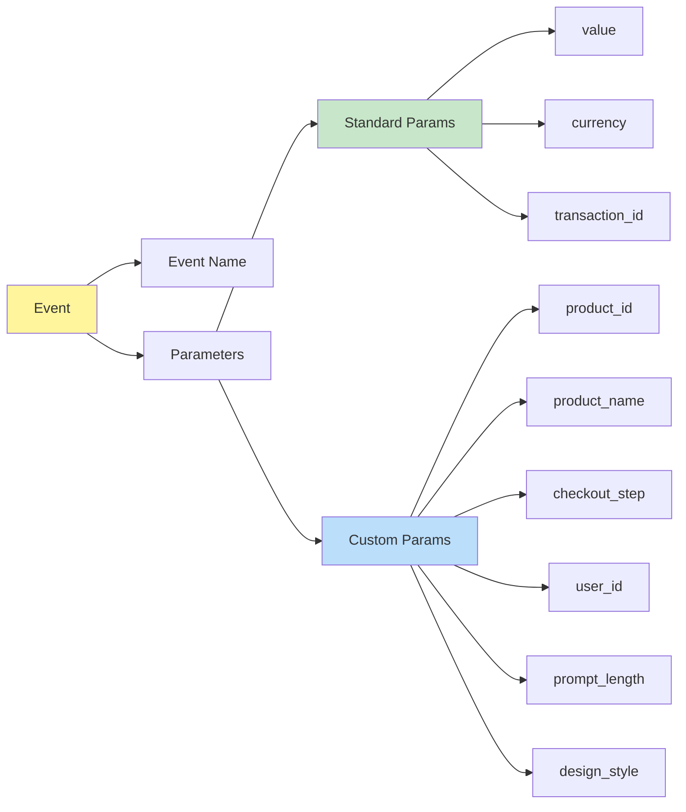

# Analytics Event Flow Diagrams

These diagrams show the complete user journey and which events are tracked at each step.

## Complete User Journey

## Design Creation Funnel

## Product Customization Funnel

## Checkout Funnel (3 Steps)

## Event Timeline Example

## Conversion Funnel Metrics

## Data Flow Architecture

## Event Parameters Structure

---

## How to Use These Diagrams

1. **Planning**: Use these to understand the complete tracking implementation
2. **Debugging**: Follow the flow to identify which events should fire when
3. **Documentation**: Share with stakeholders to explain data collection
4. **Optimization**: Identify bottlenecks in the funnel

## Viewing These Diagrams

These diagrams use Mermaid syntax. To view them:

1. **GitHub**: Renders automatically when viewing on GitHub
2. **VS Code**: Install "Markdown Preview Mermaid Support" extension
3. **Online**: Copy to https://mermaid.live/
4. **Documentation Sites**: Most support Mermaid natively

## Creating Custom Diagrams

To create your own funnel diagrams based on your data:

1. Export event counts from GA4
2. Calculate conversion rates between steps
3. Use the Conversion Funnel template above
4. Update the numbers with your actual data
